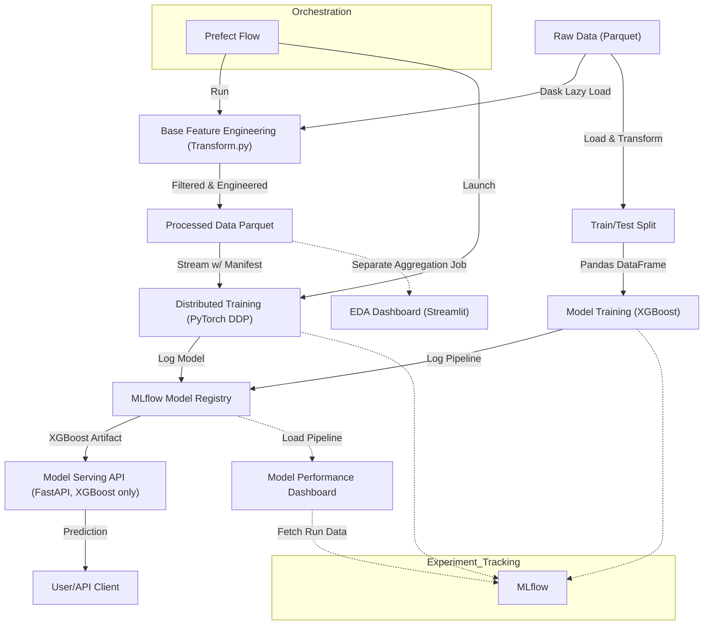

# NYC-Taxi-MLOPS

## Project Architecture Diagram

### Diagram Explanation

This diagram illustrates the end-to-end MLOps pipeline for NYC Taxi fare prediction:

- **Raw Data (Parquet):** Source data files, loaded lazily using Dask for scalability.
- **Base Feature Engineering (Transform.py):** Cleans and engineers base features using Dask (see `src/features/transform.py`).
- **Processed Data Parquet:** Output of feature engineering, partitioned and ready for training.
- **Train/Test Split → Model Training (XGBoost):** Local training path. Data is materialized to Pandas, split, and used to train an XGBoost pipeline (see `src/training/train.py`).
- **Stream w/ Manifest → Distributed Training (PyTorch DDP):** Distributed training path. Data is streamed directly from Parquet using a manifest file for efficient sharding and processed by PyTorch DDP (see `src/training/train_pytorch_ddp.py`).
- **MLflow Model Registry:** Both training paths log their models to MLflow for experiment tracking and model registry.
- **Model Serving API (FastAPI, XGBoost only):** Serves predictions using the XGBoost pipeline artifact (see `src/serving/app.py`).
- **User/API Client:** Consumes predictions from the API.
- **EDA Dashboard (Streamlit):** Loads pre-aggregated summaries for exploratory data analysis (see `src/ui/pages/1_EDA.py`).
- **Model Performance Dashboard:** Loads the pipeline from MLflow to display metrics and feature importances (see `src/ui/pages/2_Model_Performance.py`).
- **Prefect Flow:** Orchestrates ETL and distributed training (see `src/serving/flow.py`).
- **MLflow:** Used for experiment tracking, metrics, and model registry.

Each component in the diagram maps directly to a module or script in the codebase, ensuring reproducibility, scalability, and clear separation of concerns.
