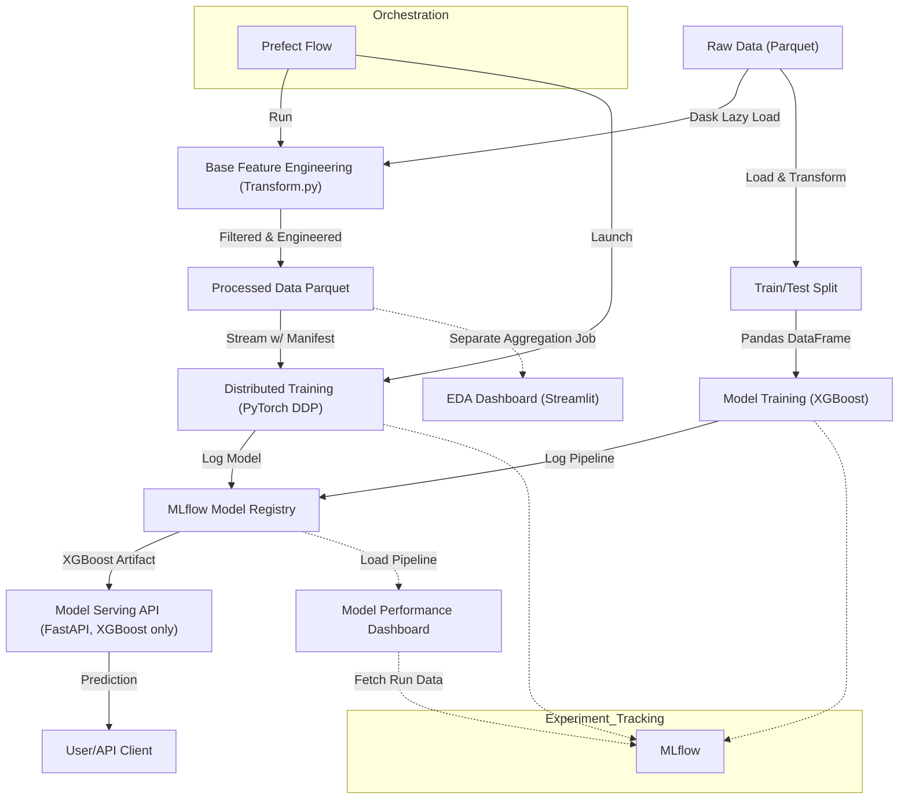

# NYC-Taxi-MLOPS

## Project Architecture Diagram

```mermaid
flowchart TD
    A["Raw Data (Parquet)"] -->|Dask Lazy Load| B["Base Feature Engineering (Transform.py)"]
    B -->|Filtered & Engineered| C["Processed Data Parquet"]
    C -->|Stream w/ Manifest| E2["Distributed Training (PyTorch DDP)"]
    E2 -->|Log Model| F["MLflow Model Registry"]
    A -->|Load & Transform| D["Train/Test Split"]
    D -->|Pandas DataFrame| E["Model Training (XGBoost)"]
    E -->|Log Pipeline| F
    F -->|XGBoost Artifact| G["Model Serving API (FastAPI, XGBoost only)"]
    G -->|Prediction| H["User/API Client"]
    C -.->|Separate Aggregation Job| I["EDA Dashboard (Streamlit)"]
    F -.->|Load Pipeline| J["Model Performance Dashboard"]
    subgraph Orchestration
      K["Prefect Flow"]
    end
    K -->|Run| B
    K -->|Launch| E2
    subgraph Experiment_Tracking
      L["MLflow"]
    end
    E -.-> L
    E2 -.-> L
    J -.->|Fetch Run Data| L
```
