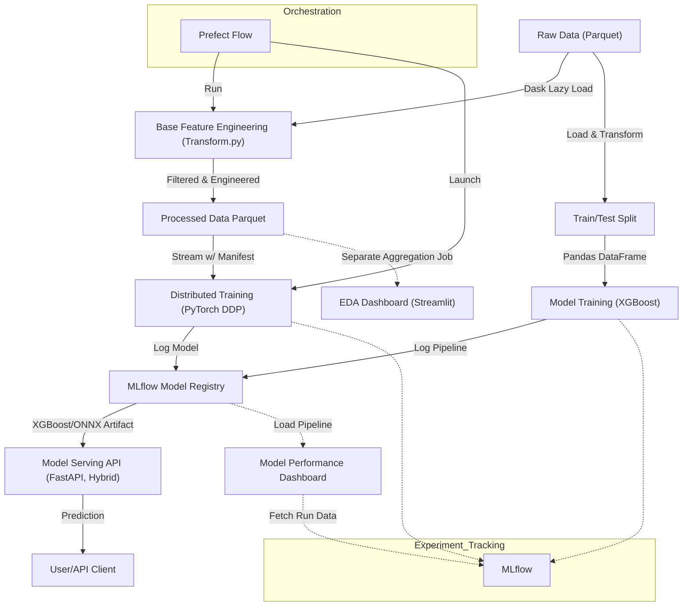

# NYC-Taxi-MLOPS

## Project Architecture Diagram

### Diagram Explanation

This diagram illustrates the end-to-end MLOps pipeline for NYC Taxi fare prediction:

- **Raw Data (Parquet):** Source data files, loaded lazily using Dask for scalability.
- **Base Feature Engineering (Transform.py):** Cleans and engineers base features using Dask (see `src/features/transform.py`).
- **Processed Data Parquet:** Output of feature engineering, partitioned and ready for training.
- **Train/Test Split → Model Training (XGBoost):** Local training path. Data is materialized to Pandas, split, and used to train an XGBoost pipeline (see `src/training/train.py`).
- **Stream w/ Manifest → Distributed Training (PyTorch DDP):** Distributed training path. Data is streamed directly from Parquet using a manifest file for efficient sharding and processed by PyTorch DDP with `torch.compile` optimization (see `src/training/train_pytorch_ddp.py`).
- **MLflow Model Registry:** Both training paths log their models to MLflow for experiment tracking and model registry.
- **Model Serving API (FastAPI, Hybrid):** Serves predictions using either the XGBoost pipeline (Cloud) or ONNX artifact (Edge) (see `src/serving/app.py`).
- **User/API Client:** Consumes predictions from the API.
- **EDA Dashboard (Streamlit):** Loads pre-aggregated summaries for exploratory data analysis (see `src/ui/pages/1_EDA.py`).
- **Model Performance Dashboard:** Loads the pipeline from MLflow to display metrics and feature importances (see `src/ui/pages/2_Model_Performance.py`).
- **Prefect Flow:** Orchestrates ETL and distributed training (see `src/serving/flow.py`).
- **MLflow:** Used for experiment tracking, metrics, and model registry.

Each component in the diagram maps directly to a module or script in the codebase, ensuring reproducibility, scalability, and clear separation of concerns.

### Edge & On-Premise Deployment

While the documentation highlights cloud scalability, the architecture is designed to be **infrastructure-agnostic**, making it equally suitable for on-premise and edge environments:

- **Edge Robotic Systems:** This pipeline can be containerized and deployed to edge robotic systems using the same Docker/Kubernetes logic used in the cloud.
- **Storage Independence:** The codebase utilizes `fsspec` (in `transform.py` and `app.py`), allowing seamless switching between cloud storage (S3/GCS) and local on-premise storage (MinIO, NFS) without code changes.
- **Low-Latency Inference:** For resource-constrained edge devices, the architecture supports exporting models to ONNX (Open Neural Network Exchange) to run on specialized hardware accelerators.

## Production Hardening and Scalability Enhancements

The following improvements are now implemented in code to target petabyte scale and edge readiness:

- DDP backend is configurable via `DDP_BACKEND` and falls back from `nccl` to `gloo` when needed.
- ETL writes a `_manifest.json` with `.parquet` file paths to avoid expensive list operations at scale.
- PyTorch training is configurable via env vars: `EPOCHS`, `BATCH_SIZE`, `NUM_WORKERS`, `GRAD_ACCUMULATION_STEPS`, `LOG_STEP_INTERVAL`.
- Training includes checkpoint resume, local step-based MLflow metric logging, and CPU/GPU warmup paths.
- Serving has a `MAX_BATCH_SIZE` guard, warmup modeling, and ONNX/sklearn fallback behavior.
- Prefect flow now supports `NPROC_PER_NODE`, `RDZV_ENDPOINT`, and can run on multi-node clusters.

