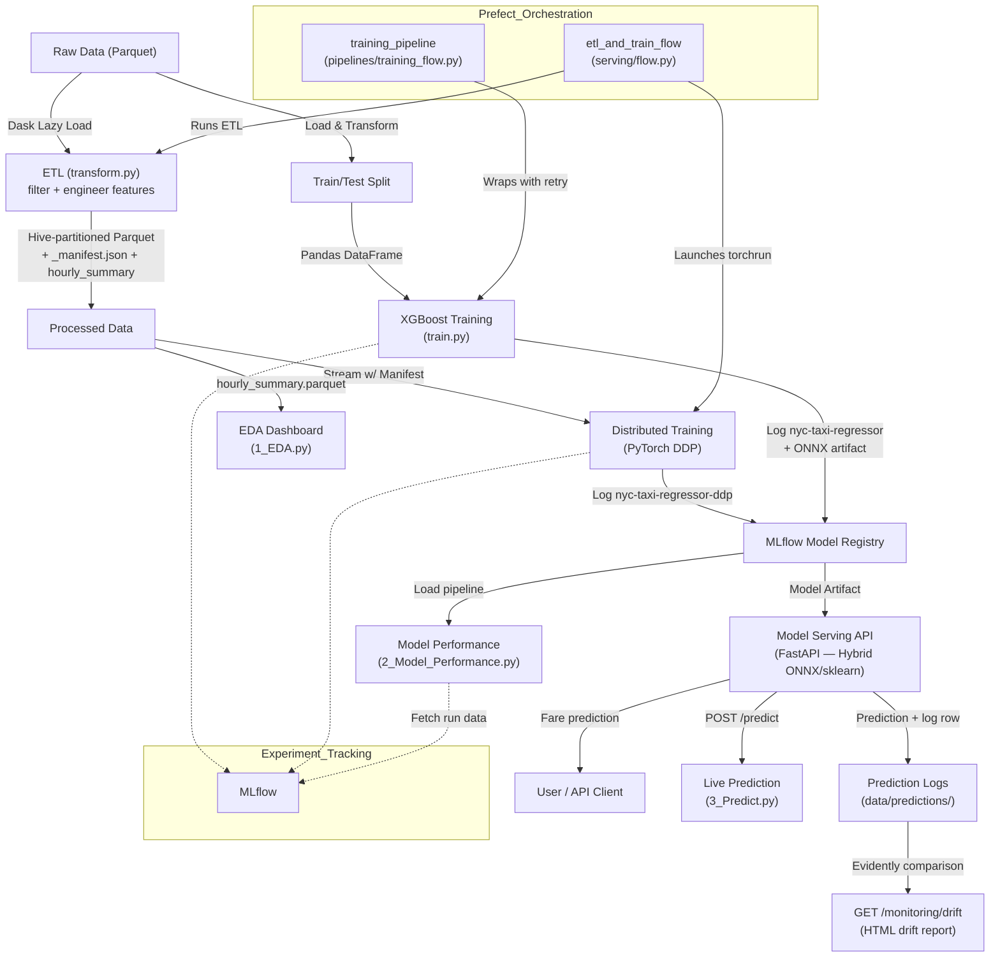

# NYC-Taxi-MLOPS

## Project Architecture Diagram

### Diagram Explanation

This diagram illustrates the end-to-end MLOps pipeline for NYC Taxi fare prediction:

- **Raw Data (Parquet):** Source NYC TLC green taxi parquet files (~48k rows/month), loaded lazily using Dask for scalability.
- **ETL (transform.py):** Cleans and engineers base features using Dask (`filter_outliers`, `engineer_features`). Writes Hive-partitioned Parquet, a versioned `_manifest.json` (v1 dict with `snapshot_hash`, `created_at`, `file_count`, `files`) for O(1) file discovery and data reproducibility, and auto-generates `hourly_summary.parquet` for the EDA dashboard.
- **Processed Data:** Hive-partitioned Parquet (by `pickup_month`) containing `BASE_FEATURE_COLS + fare_amount`. Derived temporal features (`is_weekend`, `hour_sin`, `hour_cos`) are never stored — always generated on-the-fly by `TemporalFeatureEngineer`.
- **XGBoost Training (train.py):** Materializes Dask to Pandas, fits a `sklearn.Pipeline([TemporalFeatureEngineer, XGBRegressor])`, logs to MLflow as `nyc-taxi-regressor` with data provenance tags (`data_raw_hash`, `data_processed_hash`, `data_created_at`, `data_file_count`), and exports an INT8-quantized ONNX artifact for edge deployment.
- **Distributed Training (PyTorch DDP):** Streams Parquet data via `_manifest.json` (O(1) RAM), trains `TabularNet` (MLP 128→64→1) with gradient accumulation, AMP, and `torch.compile`. Logs to MLflow as `nyc-taxi-regressor-ddp`. Exports ONNX for edge.
- **MLflow Model Registry:** Central artifact store for both training paths. Experiment tracking, metrics, and model versioning.
- **Model Serving API (FastAPI, Hybrid):** On startup, loads ONNX if `MODEL_PATH` ends with `.onnx`, otherwise loads the sklearn pipeline via `fsspec` (supports local, S3, GCS paths). Serves `POST /predict` (single), `POST /predict_batch` (up to `MAX_BATCH_SIZE`). Logs every prediction to `data/predictions/` (date-partitioned Parquet).
- **GET /monitoring/drift:** Generates an [Evidently](https://docs.evidentlyai.com/) HTML data drift report comparing `data/processed/` (reference) against `data/predictions/` (live inputs).
- **EDA Dashboard (1_EDA.py):** Loads `data/summary/hourly_summary.parquet` (auto-generated by ETL) for exploratory data analysis.
- **Model Performance (2_Model_Performance.py):** Loads the sklearn pipeline from MLflow, extracts the XGBRegressor to display feature importances and eval metrics.
- **Live Prediction (3_Predict.py):** Streamlit form that calls `POST /predict` and displays the returned fare.
- **Prefect Orchestration:** Two distinct flows — `training_pipeline` wraps XGBoost training with retry logic; `etl_and_train_flow` runs Dask ETL then launches `torchrun` for DDP.

Each component in the diagram maps directly to a module or script in the codebase, ensuring reproducibility, scalability, and clear separation of concerns.

### Edge & On-Premise Deployment

While the documentation highlights cloud scalability, the architecture is designed to be **infrastructure-agnostic**, making it equally suitable for on-premise and edge environments:

- **Edge Robotic Systems:** This pipeline can be containerized and deployed to edge robotic systems using the same Docker/Kubernetes logic used in the cloud.
- **Storage Independence:** The codebase utilizes `fsspec` (in `transform.py` and `app.py`), allowing seamless switching between cloud storage (S3/GCS) and local on-premise storage (MinIO, NFS) without code changes.
- **Low-Latency Inference:** For resource-constrained edge devices, the architecture supports exporting models to ONNX (Open Neural Network Exchange) to run on specialized hardware accelerators (TensorRT → CUDA → CPU). `edge_run.py` adds LRU caching, OTA hot-swap, and a distance-based heuristic fallback for SLA compliance.

## Production Hardening and Scalability Enhancements

The following improvements are now implemented in code to target petabyte scale and edge readiness:

- DDP backend is configurable via `DDP_BACKEND` and falls back from `nccl` to `gloo` when needed.
- ETL writes a versioned `_manifest.json` (v1 dict with `snapshot_hash`, `created_at`, `file_count`, `files`) to avoid expensive list operations at scale and uniquely fingerprint each data snapshot.
- PyTorch training is configurable via env vars: `EPOCHS`, `BATCH_SIZE`, `NUM_WORKERS`, `GRAD_ACCUMULATION_STEPS`, `LOG_STEP_INTERVAL`.
- Training includes checkpoint resume, local step-based MLflow metric logging, and CPU/GPU device selection paths (NCCL→CUDA, Gloo→CPU, with conditional AMP and `GradScaler`).
- Serving has a `MAX_BATCH_SIZE` guard, warmup inference on startup, and ONNX/sklearn fallback behavior.
- Prefect flow supports `NPROC_PER_NODE`, `RDZV_ENDPOINT`, and can run on multi-node clusters.
- Prediction inputs are logged to `data/predictions/` and exposed via `GET /monitoring/drift` (Evidently).
- **Data Versioning:** `compute_data_hash()` computes an MD5 snapshot hash over `(filename, filesize)` pairs (metadata-only, S3-safe). `get_data_version()` reads the manifest and returns the version dict. Every MLflow training run is tagged with `data_raw_hash` and `data_processed_hash`, making each run fully traceable back to its exact input data.
